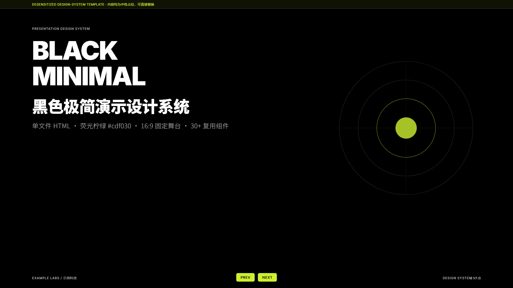
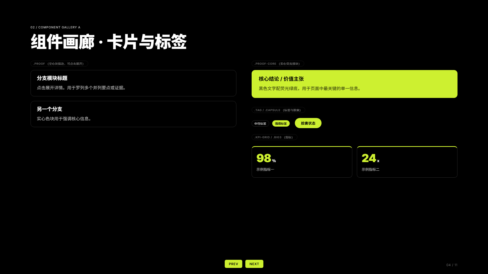

# Black Minimal Deck · 黑色极简演示设计系统

纯黑底 + 荧光柠绿的**单文件 HTML 演示设计系统**，同时是一份可直接安装到
WorkBuddy / Codex / Claude Code 等 Agent 的技能（SKILL.md）。



## 特性

- **单文件交付**：样式、脚本、组件全部内联，双击即在浏览器演示，仅依赖 Google Fonts（离线自动回退）
- **固定 16:9 舞台**：1920×1080 设计稿，任意窗口等比缩放居中
- **30+ 复用组件**：KPI 卡、漏斗、对比表、链路图、数据表、柱状图、章节巨号……
- **主题化**：所有颜色收敛在 `:root` 设计令牌，改一个 `--accent` 即整体换肤
- **一键导出 PPTX**：Playwright 3840×2160 逐页截图 → python-pptx 全出血拼页，零变形
- **已脱敏**：模板内不含任何真实公司 / 人名 / 数据 / 照片，全部为中性占位内容

## 目录结构

```
black-minimal-deck/
├── SKILL.md              # Agent 技能说明（WorkBuddy / Codex / Claude Code 通用格式）
├── README.md
├── templates/
│   └── deck.html         # 设计系统模板：令牌页 + 组件画廊 + 示例页（11 页）
├── scripts/
│   └── render_pptx.py    # HTML → PPTX 导出脚本
└── docs/
    └── preview-*.png     # 模板预览截图
```

## 快速开始

**直接演示**：双击 `templates/deck.html`，或浏览器打开后用
`deck.html#slide-3` 直达第 3 页。翻页：方向键 / 滚轮 / 触屏滑动 / PREV·NEXT。

**二次创作**：复制 `templates/deck.html`，替换各 `<section class="slide">`
内容即可。设计令牌、字体层级、组件用法、版式配方详见
[SKILL.md](SKILL.md)（它同时是给 Agent 看的完整规范）。

**安装为 Agent 技能**：把本仓库放进技能目录即可——
WorkBuddy / Claude Code 放 `~/.claude/skills/black-minimal-deck/`（或对应
skills 目录），Codex 同理。之后对 Agent 说「用黑色极简风做一套 PPT」即可触发。

**导出 PPTX**：

```bash
pip install playwright python-pptx
playwright install chromium
python scripts/render_pptx.py templates/deck.html my-deck.pptx
```

## 设计令牌

| Token | 值 | 用途 |
|---|---|---|
| `--bg` | `#000000` | 背景 |
| `--text` | `#FFFFFF` | 主文字 |
| `--accent` | `#cdf030` | 强调（序号 / 高亮 / 实心块 / 图表） |
| `--gray` | `#bbbbbb` | 次级文字 |
| `--line` | `rgba(187,187,187,.25)` | 描边 / 分隔线 |
| `--pad-x / --pad-y` | `120px / 100px` | 页面安全边距 |

字体：`Inter`（西文）+ `Noto Sans SC`（中文），字重 300–900。

## 设计约束

1. 颜色一律走 CSS 变量，禁止散落硬编码色值
2. 禁止 emoji、紫粉渐变、AI 模板感装饰
3. 固定 16:9，内容不出血；留白是设计的一部分
4. 中文 `Noto Sans SC`，西文 `Inter`

## 预览



## License

MIT
